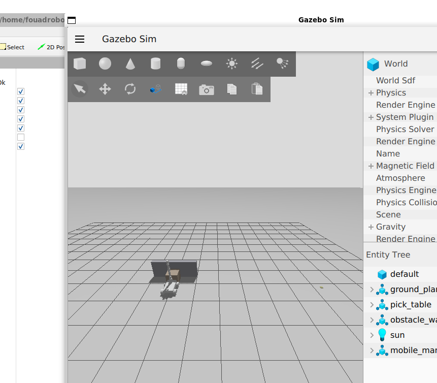
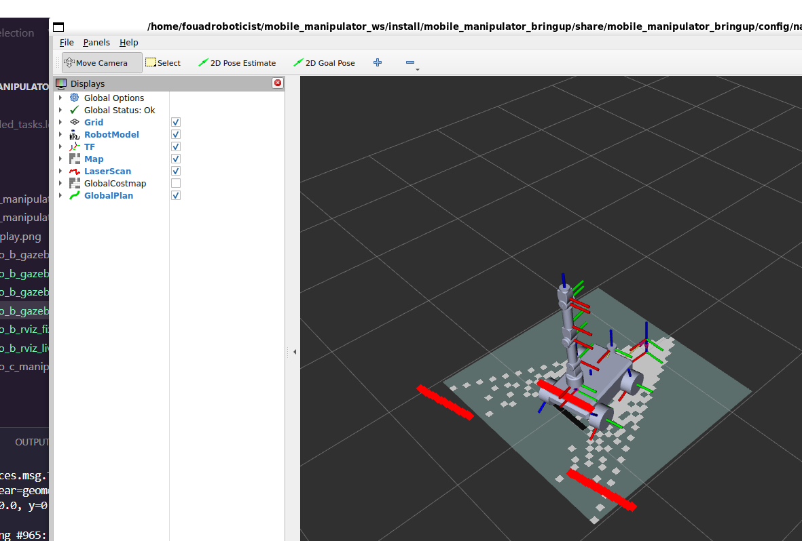
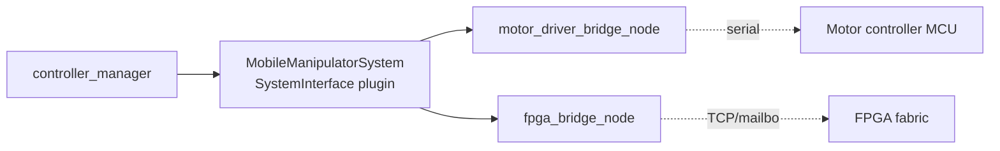

# Mobile Manipulator — ROS 2 Jazzy


A 4-wheel differential-drive mobile base carrying a 5-DOF arm, built as a
modern `ros2_control` system: **the same hardware-interface contract
drives both Gazebo Sim simulation and a documented real-hardware
deployment path**, so moving from sim to a physical robot is a plugin
swap, not a redesign.

## Architecture


**The load-bearing design decision:** `mobile_manipulator.ros2_control.xacro`
declares one `<ros2_control>` block with a `sim_mode` argument that swaps
only the `<hardware><plugin>` line between `gz_ros2_control/GazeboSimSystem`
and `mobile_manipulator_hardware/MobileManipulatorSystem`. Every
controller, every YAML config, every launch file above that line is
identical for simulation and real hardware.

## Repository structure

```
src/
  mobile_manipulator_description/   # URDF/xacro, STL meshes, RViz config
  mobile_manipulator_gazebo/        # Gazebo Sim (Harmonic+) world + ros2_control bridge
  mobile_manipulator_control/       # controller_manager YAML, controller launch
  mobile_manipulator_hardware/      # motor/FPGA bridge nodes, hardware plugin design
  mobile_manipulator_interfaces/    # HardwareStatus.msg
  mobile_manipulator_bringup/       # display + 3 demonstration scenarios
docs/
  PHYSICAL_AI_ROADMAP.md            # vision/grasping/RL/swarm attachment points
images/                             # README screenshots
```

## Quick start

```bash
mkdir -p ~/ros2_ws/src && cd ~/ros2_ws/src
git clone https://github.com/Fouad-Smaoui/Mobile-Manipulator-Robot.git .
cd ~/ros2_ws && colcon build && source install/setup.bash

# fastest sanity check -- RViz only, no physics
ros2 launch mobile_manipulator_bringup display.launch.py

# full Gazebo simulation with ros2_control active
ros2 launch mobile_manipulator_gazebo gazebo_sim.launch.py
```

Requires ROS 2 Jazzy + Gazebo Sim (Harmonic+), and `ros2_control` /
`gz_ros2_control` / `ros_gz_sim` / `nav2_bringup` / `slam_toolbox`:

```bash
sudo apt install ros-jazzy-controller-manager ros-jazzy-joint-state-broadcaster \
  ros-jazzy-diff-drive-controller ros-jazzy-joint-trajectory-controller \
  ros-jazzy-gz-ros2-control ros-jazzy-ros-gz-sim ros-jazzy-ros-gz-bridge \
  ros-jazzy-nav2-bringup ros-jazzy-slam-toolbox ros-jazzy-xacro \
  ros-jazzy-joint-state-publisher-gui ros-jazzy-teleop-twist-keyboard
```

## Demonstration scenarios

| Scenario | Command | Demonstrates |
|---|---|---|
| A — Teleoperation | `ros2 launch mobile_manipulator_bringup scenario_a_teleop.launch.py` | URDF + ros2_control velocity interface + diff-drive kinematics, end-to-end |
| B — Autonomous Navigation | `ros2 launch mobile_manipulator_bringup scenario_b_navigation.launch.py` | Real LiDAR → `slam_toolbox` SLAM → Nav2, verified layer-by-layer (TF, odom, costmap, navigation) against live ROS 2 state, not screenshots: `ros2 run mobile_manipulator_bringup verify_scenario_b.py` |
| C — Mobile Manipulation | `ros2 launch mobile_manipulator_bringup scenario_c_manipulation.launch.py` | `FollowJointTrajectory` goal → `joint_trajectory_controller` → simulated arm motion, verified end-to-end with an automated check: `ros2 run mobile_manipulator_bringup verify_scenario_c.py` |

<p>
  
  
</p>

Scenario B side-by-side: Gazebo physics (left) and RViz showing the
robot, the live SLAM-built map, and real LaserScan hits on the
obstacle (right). **Verified state, not just visually working** — two
real bugs (a `cmd_vel` message-type mismatch and a costmap
obstacle-height misconfiguration) were found and fixed by inspecting
live ROS 2 topics/services, and navigation reliability was pushed as
far as is honestly possible: the one remaining class of failure is
`RegulatedPurePursuitController` correctly refusing to rotate through
an inflated-cost zone near clutter — a safety behavior, not a bug. Full
investigation, evidence, and the inflation-radius/reachability
tradeoff this surfaced: [`docs/TESTING.md`](docs/TESTING.md).

Full walkthroughs, expected output, and launch options for each scenario:
[`mobile_manipulator_bringup/doc/SCENARIOS.md`](src/mobile_manipulator_bringup/doc/SCENARIOS.md).

## Hardware deployment



Full signal path and deployment steps:
[`mobile_manipulator_hardware/doc/HARDWARE.md`](src/mobile_manipulator_hardware/doc/HARDWARE.md).

## Roadmap

1. CI running `colcon build` + `colcon test` on every push.
2. ~~LiDAR mount + Gazebo Sim `gpu_lidar` sensor to make Scenario B obstacle-aware.~~
   **Done** — `gpu_lidar` on `lidar_link`, live `slam_toolbox` SLAM, Nav2
   costmaps verified to actually mark real obstacles. See `docs/TESTING.md`.
3. MoveIt config for the 5-DOF arm, replacing Scenario C's scripted joint goal with real IK.
4. Implement the `MobileManipulatorSystem` pluginlib plugin against a real motor driver board.
5. Gripper + `tool0` end-effector for an actual pick-and-place, not just a reach gesture.
6. Camera mount + a perception package (hook documented in `docs/PHYSICAL_AI_ROADMAP.md`).
7. Tune `inflation_radius`/footprint padding for Scenario B to widen the
   goal-reachability envelope near clutter without losing real collision
   safety margin — a measured tradeoff, not yet attempted (`docs/TESTING.md`).
8. Swarm namespacing demo (multi-robot launch).
9. Reinforcement-learning environment wrapping `gazebo_sim.launch.py` (hook documented in `docs/PHYSICAL_AI_ROADMAP.md`).

Physical-AI specific attachment points (vision, grasping, RL, swarm):
[`docs/PHYSICAL_AI_ROADMAP.md`](docs/PHYSICAL_AI_ROADMAP.md).

## License
CC0 1.0 Universal — see [LICENSE](LICENSE).
