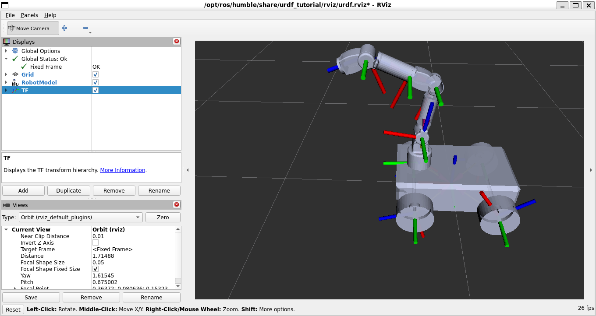
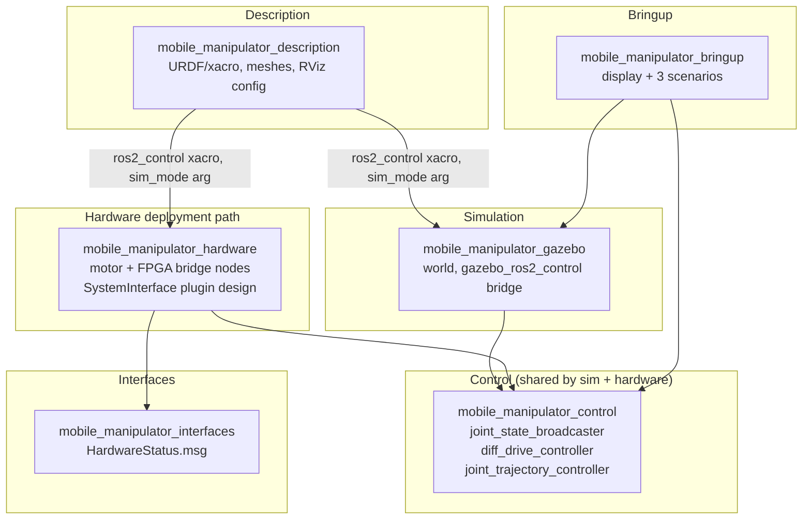
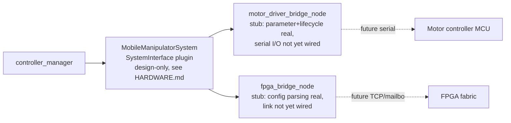

# Mobile Manipulator — ROS 2 Humble



A 4-wheel differential-drive mobile base carrying a 5-DOF arm, built as a
modern `ros2_control` system: **the same hardware-interface contract
drives both Gazebo simulation and a documented real-hardware deployment
path**, so moving from sim to a physical robot is a plugin swap, not a
redesign.

This repository was forensically audited and restructured from a mixed
ROS2-learning sandbox into a single-purpose project. The audit findings
and what was removed are in [`docs/`](docs/) — nothing here is hidden,
including what doesn't work yet.

## Architecture



**The load-bearing design decision:** `mobile_manipulator.ros2_control.xacro`
declares one `<ros2_control>` block with a `sim_mode` argument that swaps
only the `<hardware><plugin>` line between `gazebo_ros2_control/GazeboSystem`
and `mobile_manipulator_hardware/MobileManipulatorSystem`. Every
controller, every YAML config, every launch file above that line is
identical for simulation and real hardware.

## Repository structure

```
src/
  mobile_manipulator_description/   # URDF/xacro, STL meshes, RViz config
  mobile_manipulator_gazebo/        # Gazebo Classic world + ros2_control bridge
  mobile_manipulator_control/       # controller_manager YAML, controller launch
  mobile_manipulator_hardware/      # motor/FPGA bridge nodes, hardware plugin design
  mobile_manipulator_interfaces/    # HardwareStatus.msg
  mobile_manipulator_bringup/       # display + 3 demonstration scenarios
docs/
  PHYSICAL_AI_ROADMAP.md            # vision/grasping/RL/swarm attachment points
  RECRUITER_ASSESSMENT.md           # role-by-role honest self-review
images/                             # README screenshots
```

## Quick start

```bash
mkdir -p ~/ros2_ws/src && cd ~/ros2_ws/src
git clone https://github.com/Fouad-Smaoui/Mobile-Manipulator-Robot.git .
cd ~/ros2_ws && colcon build && source install/setup.bash

# fastest sanity check -- RViz only, no physics
ros2 launch mobile_manipulator_bringup display.launch.py

# full Gazebo simulation with ros2_control active
ros2 launch mobile_manipulator_gazebo gazebo_sim.launch.py
```

Requires ROS 2 Humble, Gazebo Classic 11, and `ros2_control` /
`gazebo_ros2_control` / `nav2_bringup` / `slam_toolbox` (`apt install
ros-humble-{ros2-control,ros2-controllers,gazebo-ros2-control,nav2-bringup,slam-toolbox}`).

## Demonstration scenarios

| Scenario | Command | Demonstrates |
|---|---|---|
| A — Teleoperation | `ros2 launch mobile_manipulator_bringup scenario_a_teleop.launch.py` | URDF + ros2_control velocity interface + diff-drive kinematics, end-to-end |
| B — Autonomous Navigation | `ros2 launch mobile_manipulator_bringup scenario_b_navigation.launch.py` | Nav2 + slam_toolbox wired against this robot's footprint and TF tree |
| C — Mobile Manipulation | `ros2 launch mobile_manipulator_bringup scenario_c_manipulation.launch.py` | `FollowJointTrajectory` goal → `joint_trajectory_controller` → simulated arm motion |

Full expected output and known limitations for each scenario:
[`mobile_manipulator_bringup/doc/SCENARIOS.md`](src/mobile_manipulator_bringup/doc/SCENARIOS.md).

## Hardware deployment



Full signal path, what's real vs. placeholder today, and the exact steps
to make it real: [`mobile_manipulator_hardware/doc/HARDWARE.md`](src/mobile_manipulator_hardware/doc/HARDWARE.md).

## Roadmap

Ranked by impact, not implemented yet:
1. Record and embed a Gazebo run of Scenario A — turns "should work" into proof.
2. CI running `colcon build` + `colcon test` on every push.
3. LiDAR mount + Gazebo ray sensor (hooks already commented in `mobile_manipulator_gazebo`'s xacro) to make Scenario B obstacle-aware.
4. MoveIt config for the 5-DOF arm, replacing Scenario C's scripted joint goal with real IK.
5. Implement the `MobileManipulatorSystem` pluginlib plugin against a real motor driver board.
6. Gripper + `tool0` end-effector for an actual pick-and-place, not just a reach gesture.
7. Camera mount + a perception package (hook documented in `docs/PHYSICAL_AI_ROADMAP.md`).
8. Static map for Scenario B once a real or simulated LiDAR exists, removing the slam_toolbox dependency for repeatable nav benchmarks.
9. Swarm namespacing demo (multi-robot launch) — the launch files already avoid hardcoded global topics.
10. Reinforcement-learning environment wrapping `gazebo_sim.launch.py` (hook documented in `docs/PHYSICAL_AI_ROADMAP.md`).

Physical-AI specific attachment points (vision, grasping, RL, swarm):
[`docs/PHYSICAL_AI_ROADMAP.md`](docs/PHYSICAL_AI_ROADMAP.md).

## Honest assessment

A role-by-role review (ROS2 engineer, robotics engineer, controls
engineer, systems integration engineer, technical recruiter) — strengths,
weaknesses, and exactly what evidence is still missing:
[`docs/RECRUITER_ASSESSMENT.md`](docs/RECRUITER_ASSESSMENT.md).

## License
CC0 1.0 Universal — see [LICENSE](LICENSE).
