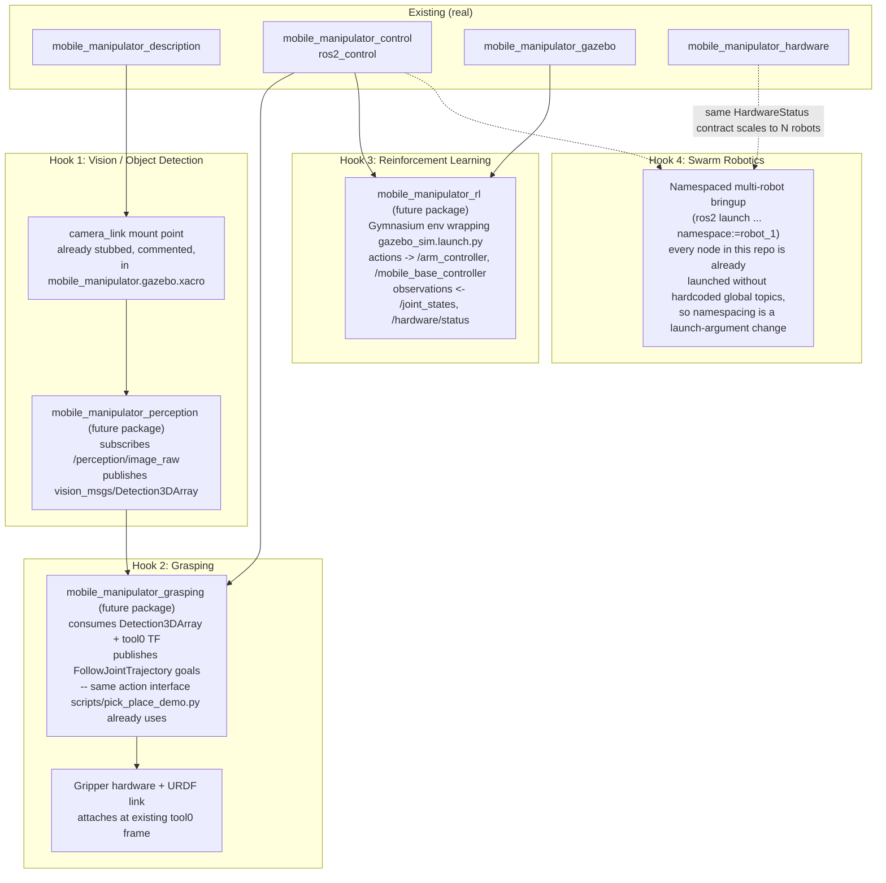

# Physical AI Roadmap — Architecture Hooks Only

This document specifies *where* future autonomy work attaches to the
existing architecture. Nothing here is implemented; the goal is to show
that the current package boundaries were chosen so these additions are
extensions, not rewrites.

## Hook 1 — Vision / Object Detection
**Attachment point:** the commented-out camera/LiDAR `<gazebo>` sensor
blocks in `mobile_manipulator_gazebo/urdf/mobile_manipulator.gazebo.xacro`,
and a `camera_link`/`lidar_link` mount that needs adding to `base.xacro`.
**Why this boundary:** perception should not live inside `_description` or
`_control` — it's a new package (`mobile_manipulator_perception`) so a
detector swap (classical CV vs. a YOLO/ONNX node) never touches the robot
model or the controllers.

## Hook 2 — Grasping
**Attachment point:** the `tool0` frame already defined at the end of
`arm.xacro`, and the `FollowJointTrajectory` action interface already
exercised by `scripts/pick_place_demo.py` in Scenario C.
**Why this boundary:** a grasp planner only needs to produce trajectory
goals against an interface that already exists and is already exercised —
no new control-stack plumbing required, only a smarter goal source
replacing the hand-picked `REACH_POSE` constant.

## Hook 3 — Reinforcement Learning
**Attachment point:** `gazebo_sim.launch.py` as the environment backend,
`/joint_states` + `/hardware/status` as the observation source,
`/arm_controller` + `/mobile_base_controller` as the action sink.
**Why this boundary:** because the simulation and the real-hardware path
share the same `ros2_control` interface (`mobile_manipulator.ros2_control.xacro`),
a policy trained in Gazebo through this exact interface transfers to
hardware without an action-space redefinition.

## Hook 4 — Swarm Robotics
**Attachment point:** none of the launch files in this repo hardcode a
global namespace — every topic is relative to the node's default
namespace already. Multi-robot deployment is a `namespace:=` launch
argument plus per-robot TF prefixes, not a redesign.

## Explicit non-goals of this document
This roadmap intentionally does not include effort estimates, model
choices, or training infrastructure — those are implementation decisions
to make at the time each hook is actually built, not now.
