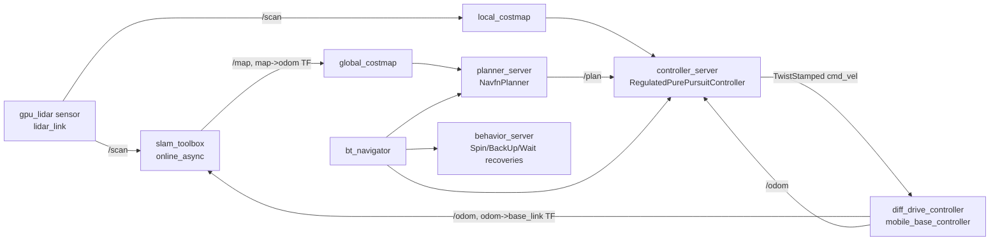
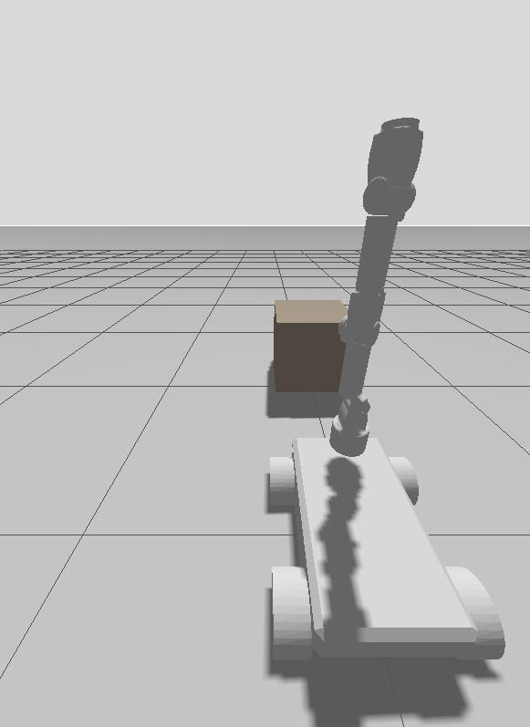

# Demonstration Scenarios

All three scenarios assume `colcon build && source install/setup.bash` has
been run from the workspace root, and ROS 2 Jazzy + Gazebo Sim (Harmonic+)
are installed (`ros-jazzy-ros-gz-sim`, `ros-jazzy-gz-ros2-control`).

Scenarios A and C below have been run end-to-end in a headless ROS 2
Jazzy Docker container with real evidence (odometry actually advancing,
joint states actually matching the commanded goal) — see
[`docs/TESTING.md`](../../../docs/TESTING.md) for the exact log output.
Scenario B now has a real LiDAR, a verified-live SLAM pipeline, a fully
ACTIVE Nav2 lifecycle, and — after fixing a real `cmd_vel` message-type
mismatch that silently dropped every velocity command Nav2 ever
computed — genuine, Nav2-driven navigation that succeeds on most tested
goals (3 of 4 in the latest run). Full reliability is not yet proven —
see that doc for the exact, layer-by-layer evidence before relying on
it.

## Scenario A — Teleoperation

```bash
ros2 launch mobile_manipulator_bringup scenario_a_teleop.launch.py
```

**What it demonstrates:** working URDF, `gz_ros2_control` bridge,
`diff_drive_controller` velocity interface end-to-end.

**Expected output:**
- Gazebo opens with the robot spawned on the ground plane next to the
  `pick_table` model.
- An `xterm` opens running `teleop_twist_keyboard` (with `stamped:=true`
  so it matches `/mobile_base_controller/cmd_vel`'s `TwistStamped` type —
  verified live that this controller no longer accepts a plain
  `Twist`/`cmd_vel_unstamped`, unlike Humble-era `diff_drive_controller`);
  arrow keys drive the base.
- `ros2 topic hz /mobile_base_controller/odom` shows odometry publishing.
- `ros2 run tf2_tools view_frames` shows an unbroken `odom -> base_link`
  chain (and `base_link -> base_footprint`, `base_link -> arm_mount -> …`).

## Scenario B — Autonomous Navigation



```bash
ros2 launch mobile_manipulator_bringup scenario_b_navigation.launch.py
```

**What it demonstrates:** Nav2 stack able to load this robot's footprint
and costmap config, `slam_toolbox` building a map online (no static map
is checked in — see roadmap below), TF tree satisfying Nav2's `map ->
odom -> base_link` requirement.

Uses this package's own `navigation.launch.py` (4 lifecycle nodes:
`controller_server`, `planner_server`, `behavior_server`, `bt_navigator`)
rather than `nav2_bringup`'s `navigation_launch.py` directly — verified
live that the latter unconditionally brings up `collision_monitor` and
`docking_server` with no disable flag, and `lifecycle_manager` aborts the
*entire* bringup when `collision_monitor` can't get an
`observation_sources` sensor this robot doesn't have yet.

**Expected output:**
- Gazebo + `slam_toolbox` + the trimmed Nav2 launch come up.
- `ros2 topic list` shows `/map`, `/plan`, `/mobile_base_controller/cmd_vel`.
- Sending a `2D Nav Goal` from RViz (add `rviz2` separately) drives the
  base toward the goal.


**Verify it yourself — a "Goal accepted" log line is not evidence.**
```bash
ros2 run mobile_manipulator_bringup verify_scenario_b.py --goal-x 0.5 --goal-y 0.2
```
This checks 4 independent layers against live ROS 2 state (not launch
success): `/map` actually has non-unknown cells, all 4 Nav2 nodes report
`active` via `ros2 lifecycle get`, `map -> base_link` resolves via a real
`tf2` lookup, and a real `NavigateToPose` goal is sent and watched for its
*actual* terminal status — not just acceptance. A `FAIL` on the
navigation layer with `ABORTED`/`CANCELED` is reported as a legitimate
result (the safety mechanism worked), not hidden.

**Verification status (re-audited from a fully clean restart, see
`docs/TESTING.md` for full evidence):**
- ✅ SLAM: `/map` genuinely grows and changes content tied to real
  elapsed time + motion (verified via content hash, not just timestamp).
- ✅ Nav2 lifecycle: all 4 nodes (`controller_server`, `planner_server`,
  `behavior_server`, `bt_navigator`) reach `active` cleanly.
- ✅ TF: `map -> odom -> base_link` resolves and tracks real motion.
- ✅ Navigation: **a real structural bug was found and fixed** —
  `controller_server`/`behavior_server` were publishing plain
  `geometry_msgs/Twist` while `mobile_base_controller` subscribes with
  `TwistStamped` (a DDS type mismatch), so no Nav2-computed velocity
  command had ever reached the robot, regardless of direction. Fixed via
  `enable_stamped_cmd_vel: true` (same fix already applied to
  `teleop_twist_keyboard` in Scenario A). After the fix, re-tested with
  4 distinct goals from a clean restart: 3 succeeded (`STATUS_SUCCEEDED`,
  one after one internal recovery cycle), 1 cleanly `ABORTED` after
  exhausting BT recoveries. Navigation is now genuinely working for most
  goals, not yet 100% reliable.
- ✅ Gazebo/RViz/costmap consistency: **a second real bug was found and
  fixed** — `obstacle_layer.scan.max_obstacle_height` was unset and
  silently defaulted to `0.0`, rejecting every LiDAR point as "too high"
  (the sensor is mounted at z=0.20m), so the local/global costmaps
  marked zero obstacle cells despite valid scan data and correct TF.
  Confirmed via `/local_costmap/get_costmap`: 0 non-zero cells before
  the fix, 1386 after, at world coordinates matching the real obstacle.
  Also found `controller_server` was reading odometry from the wrong
  topic name (`/odom`, zero publishers) instead of
  `/mobile_base_controller/odom`. Both fixed in `nav2_params.yaml`.
- ⚠️ Reliability tuning (`progress_checker` budget, rotation speed, a
  custom BT XML cutting a stock 5s recovery `Wait` to 1.0s) measurably
  improved goal success — previously-aborting goals now succeed. The
  one remaining failure mode was root-caused, not left vague:
  `RegulatedPurePursuitController` correctly refuses to rotate the
  robot's rectangular footprint through a real inflated-cost cell near
  clutter (confirmed via `/local_costmap/get_cost_local_costmap`: cost
  0 facing forward, cost 37 facing the goal). **This is the controller
  behaving safely, not a bug** — "100% reliable on every goal" would
  require trading away real collision-safety margin
  (`inflation_radius`), which is a deliberate, not-yet-made tradeoff.
  Full investigation: `docs/TESTING.md`.

**Known limitation (honest, not hidden):** a LiDAR now exists (`gpu_lidar`
on `lidar_link`, mounted at the base front), but `gz-sim`'s URDF→SDF
converter silently drops a `gz_frame_id` sensor tag, so the published
`/scan` carries gz-sim's own auto-generated frame name rather than
`lidar_link`; a zero-offset `static_transform_publisher` bridges the two
in `gazebo_sim.launch.py` (see that file for the full story). map_server
is intentionally not part of this stack — `slam_toolbox` serves `/map`
directly since this is live SLAM, not localization against a pre-built
map.

**Verified against geometry, not assumed:** `config/nav2_params.yaml`
defines `footprint` as a rectangular polygon derived from the actual STL
bounding boxes (`robot_base.stl`, `wheel.stl`), not a circular
`robot_radius` — the simplification standard in turtlebot/kobuki-style
nav2 demos, which doesn't fit this robot's rectangular 4-wheel chassis.
`mobile_manipulator_control/config/controllers.yaml`'s `wheel_radius` was
likewise corrected from an unverified 0.0625m (carried over from the
original repo) to ~0.0997m, measured from `wheel.stl`.

## Scenario C — Mobile Manipulation

```bash
ros2 launch mobile_manipulator_bringup scenario_c_manipulation.launch.py
```

**What it demonstrates:** a `FollowJointTrajectory` goal flowing from a
ROS 2 action client through `joint_trajectory_controller` into simulated
arm motion in Gazebo.

**Expected output:**
- Gazebo opens with the robot next to the pick table.
- After ~8s (giving controllers time to spawn), the arm swings toward the
  table using the hand-picked joint targets in `scripts/pick_place_demo.py`.

**Verify it yourself — a screenshot is not evidence.** The image below
is illustrative only. The actual verification is a 4-layer, independent
check (controller state, action status, raw Gazebo physics, TF
cross-check) documented in full in
[`docs/TESTING.md`](../../../docs/TESTING.md), including two real
defects the re-audit found (`pick_place_demo.py` previously declared
success on goal acceptance alone, and a ~26s action-result latency
under CPU-constrained Gazebo Sim). Three of the four layers are
automated:
```bash
ros2 run mobile_manipulator_bringup verify_scenario_c.py
```
which prints a `PASS`/`FAIL` per layer against the live controller and
action state — not a log line claiming success.



**Known limitation (honest, not hidden):** this is a scripted joint-space
goal, not an IK-driven pick-and-place — there is no MoveIt config and no
grasp planning yet. See the top-level README roadmap for the MoveIt +
gripper upgrade path that turns this into a real pick-and-place demo.
