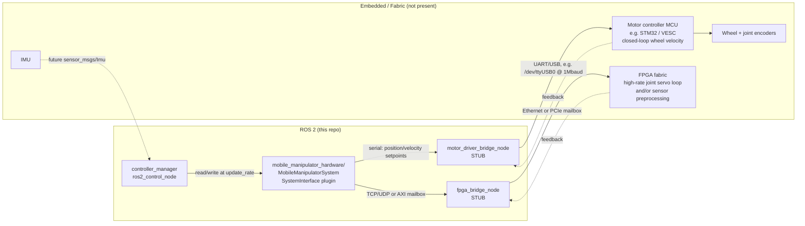

# Hardware Deployment Architecture

This document specifies exactly how this package connects to physical
hardware. Nothing in this package currently drives real actuators — every
bridge node runs in **stub mode** (see code comments). What follows is the
deployment contract these stubs are built against, so completing them is a
wiring/protocol task, not a redesign.

## Signal path

## Why two bridges instead of one

- **Motor driver bridge (serial, low-rate, ~100 Hz):** base wheel velocity
  and arm joint position setpoints — latency-tolerant, fits a UART link.
- **FPGA bridge (network/mailbox, high-rate):** reserved for any control
  loop that needs sub-millisecond determinism (e.g. current-loop motor
  control or vision preprocessing) that a Python/serial path can't meet.
  This separation is what justifies having an FPGA in the architecture at
  all — it is not a generic "extra MCU."

## What is real vs. placeholder today

| Component | Status |
|---|---|
| `ros2_control` joint/command interface contract (`mobile_manipulator.ros2_control.xacro`) | **Real** — this is what any hardware plugin must satisfy |
| `motor_driver_bridge_node.py` parameter/lifecycle contract | **Real** | 
| `motor_driver_bridge_node.py` actual serial I/O | **Stub** — `TODO(hardware)` marks the exact insertion point |
| `fpga_bridge_node.py` config parsing | **Real** |
| `fpga_bridge_node.py` actual FPGA link | **Stub** |
| `MobileManipulatorSystem` `hardware_interface::SystemInterface` plugin | **Design-only** — see `doc/reference/mobile_manipulator_system.hpp` |

## Path to a real deployment

1. Pick a motor driver board (e.g. ODrive, VESC, or a custom STM32 +
   `ros2_control`-style velocity loop) and implement the `TODO(hardware)`
   block in `motor_driver_bridge_node.py` using `pyserial`.
2. Promote `mobile_manipulator_system.hpp` from reference doc to a real
   `hardware_interface::SystemInterface` pluginlib plugin (steps listed in
   the header itself), reusing the wire protocol from step 1.
3. Wire encoder feedback into `read()` and command setpoints into `write()`.
4. Swap `sim_mode:=false` in `mobile_manipulator.urdf.xacro` and launch
   `hardware_bringup.launch.py` instead of `gazebo_sim.launch.py` — no
   controller YAML or controller node changes needed, by construction.
5. Only then implement the FPGA link the same way, if the latency budget
   of step 1–4 turns out to be insufficient.
